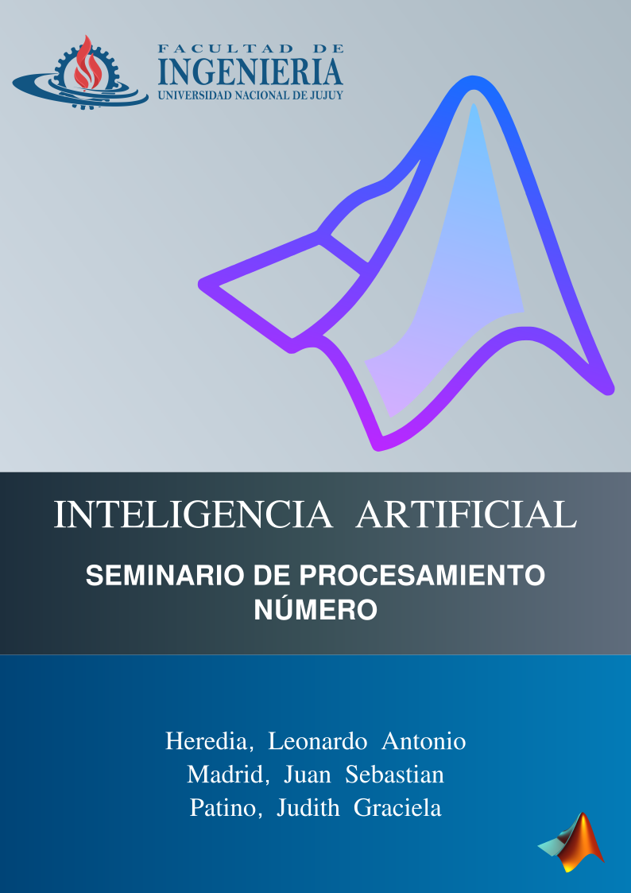

# Inteligencia Artificial | Resolución del TP01
## Integrantes

| Apellido | Nombres |
| ----------- | ----------- |
| Heredia | Leonardo Antonio |
| Madrid | Juan Sebastian |
| Patiño | Judith Graciela |



## Trabajo con matrices
### Generar matrices con las características que se indican:

1. Matriz A de 20x25 de valores enteros positivos. Extraer una matriz A1(3x8) desde la posición (5,5). Matriz A2 que resulte de la eliminación de las columnas 11 a 14 y las filas 9 a 13 de A.
```
% Con clear borramos todas las variables del workspace
clear;
% Con clc limpiamos el command windows
clc;
% Con rand obtenemos valores aleatorios decimales entre 0 y 1, ej 0.0635
% Con randi obtenemos valores aleatorios enteros positivos randi()
% Con round obtenemos valores enteros redondeados
% Generamos la matriz A de 20x25 con valores enteros positivos.
% A = randi(100,20,25)
A = round(10*(rand(20,25)));
% Extraemos la matriz A1 de 3x8 desde la posición (5,5).
A1 = A(5:7,5:12)
% Asignamos A a A2 para poder eliminar las filas y columnas
A2=A
% Primero eliminamos las columnas.
A2(:,11:14) = [];
% Luego eliminamos las filas
A2(9:13,:) = []
```

2. Matriz de 5x10 de números aleatorios enteros de dos dígitos. Determinar la posición y valor del menor y del mayor.
Dudas
Existe una funcion que devuelva un valor que devuelva un valor con un par de indices y el valor maximo,
Que pasa si hay mas de un maximo y mas de un minimo
```
% -------------------------------------------------------------------------
% TRABAJO CON MATRICES
% -------------------------------------------------------------------------
% Matriz de 5 x 10 de números aleatorios enteros de dos dígitos. Determinar
% la posición y valor del menor y del mayor.
% -------------------------------------------------------------------------
% max
% Elementos máximos de un array
% M = max(A) devuelve los elementos máximos de un array.
% -------------------------------------------------------------------------
% [M,I] = max(___) encuentra los índices de los valores máximos de A y los
% devuelve en el vector de salida I, utilizando cualquiera de los
% argumentos de entrada de las sintaxis anteriores. Si el valor máximo se
% produce más de una vez, max devuelve el índice correspondiente a la
% primera aparición.
% -------------------------------------------------------------------------
clear; clc;
%
A = randi([-99,99],5,10)
% Aquí calculamos el máximo y su posición.
[max, posMax] = max (A)
% Aquí calculamos en mínimo y su posición.
[min, posMin] = min (A)
```
3. Matriz aleatoria de 10x20, valores enteros en el intervalo (-25 ; 75). Ordenar por filas (orden creciente). Ordenar por columnas (orden decreciente).\
```
% -------------------------------------------------------------------------
% TRABAJO CON MATRICES
% -------------------------------------------------------------------------
% Matriz aleatoria de 10x20, valores enteros en el intervalo(-25;75). Ordenar
% por filas(orden creciente). Ordenar por columnas(orden decreciente).
% -------------------------------------------------------------------------
% max
% Elementos máximos de un array
% M = max(A) devuelve los elementos máximos de un array.
% -------------------------------------------------------------------------
% [M,I] = max(___) encuentra los índices de los valores máximos de A y los
% devuelve en el vector de salida I, utilizando cualquiera de los
% argumentos de entrada de las sintaxis anteriores. Si el valor máximo se
% produce más de una vez, max devuelve el índice correspondiente a la
% primera aparición.
% -------------------------------------------------------------------------
clear; clc;
A=randi([-25 75],10,20)
FilAcs = sort(A,2)
ColDec = sort(A,'descend')
```
4. Generar matriz de valores aleatorios binarios de 10x8, con un bit por celda.
a1) Utilizar la función randi(); a2) utilizar la función rand() y ajustar para que no haya parte
fraccionaria. Comparar ambos métodos.
```
clear; clc;
Arandi=randi([0 1],10,8)
Arand=round(rand(10,8))
```
Conclusión: rand para números aleatorios uniformemente distribuidos, incluidos números flotantes, mientras que randi para números enteros. 
## Graficación
### Desde la línea de comandos ejecutar las sentencias necesarias para graficar las siguientes funciones:

1. Funciones seno y coseno en el intervalo [0, 2π] con un mínimo de 100 puntos cada una, línea continua, color verde para tangente, grosor 2, marca x; color azul para secante, grosor 2, marca rombo. Graficar sobre el mismo sistema de ejes (ver comando hold on).
```
% -------------------------------------------------------------------------
% GRAFICACIÓN
% -------------------------------------------------------------------------
% Dos vectores de la misma longitud se pueden representar uno con respecto
% al otro usando la función plot.
% plot(x,y)
% La función plot acepta un argumento adicional que permite especificar el
% color, el estilo de línea y el estilo de marcador utilizando diferentes
% símbolos entre comillas simples.
% plot(x,y,"r--o")
% El comando anterior representa una línea roja (r) de guiones (--) con un
% círculo (o) como marcador.
% -------------------------------------------------------------------------
% Observe que cada comando plot ha creado una gráfica independiente. Para
% representar una línea sobre otra, use el comando hold on para mantener la
% gráfica anterior mientras se agrega otra línea.
% -------------------------------------------------------------------------
% Funciones seno y coseno en el intervalo[0,2π] con un mínimo de 100 puntos
% cada una, línea continua, color verde para tangente, grosor 2, marca x;
% color azul para secante, grosor 2, marca rombo. Graficar sobre el mismo
% sistema de ejes (ver comando hold on)
% -------------------------------------------------------------------------
% La función plot acepta entradas adicionales opcionales que consisten en
% un nombre de propiedad y un valor asociado.
% plot(y,"LineWidth",5)
% El comando anterior representa una línea gruesa.
% -------------------------------------------------------------------------
% Crear cuadrículas
% linspace: Generar un vector espaciado linealmente
% y = linspace(x1,x2) devuelve un vector de fila de 100 puntos
% equidistantes entre x1 y x2.
% y = linspace(x1,x2,n) genera n puntos. El espaciado entre los puntos es
% (x2-x1)/(n-1).
% linspace es similar al operador de dos puntos, “:”, pero proporciona
% control directo sobre el número de puntos y siempre incluye los extremos.
% “lin” en el nombre “linspace” se refiere a generar valores espaciados
% linealmente
% Si conoce el número de elementos que desea en un vector (en lugar del
% espaciado entre cada elemento), podría utilizar en su lugar la función
% linspace:
% linspace(primero,último,número_de_elementos).
% Observe el uso de comas (,) para separar las entradas de la función
% linspace.
% x = linspace(0,1,5)
% -------------------------------------------------------------------------
clear; clc;
% genero un vector espaciado linealmente en el intervalo [0,2π] con 100
% puntos
x = linspace(0,2*pi,100);
A = sin(x);
B = cos(x);
C = tan(x);
% secante
D = sec(x);
% creamos la grafica
plot(x,A,"r--o","LineWidth",1)
title('Funciones trigonometricas')
% el programa permite etiquetar los ejes
hold on
plot(x,B,"b--o","LineWidth",1)
hold on
plot(x,C,"g--x","LineWidth",2)
hold on
plot(x,D,"b--s","LineWidth",2)
xlabel('Variables independientes (x)')
ylabel('Variables dependientes (y)')
% y agregar títulos
% title('Azul sec(x), Verde tan(x)')
ylim([-1 1])
legend("sin(x)","cos(x)","tan(x)","sec(x)")

```
2. y
```
x=linspace(0,10,70);
y2=exp(((x-5).^3)/0.5);
plot(x,y2,'LineStyle','--','Color','c','LineWidth',2,'Marker','d')

```
