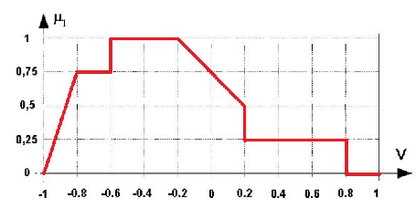
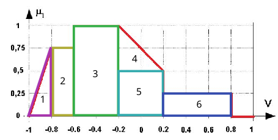

### Considerando que la gráfica siguiente corresponde a una función que ya está implicada y agregada, defuzzyficar con los siguientes criterios:
#### Calcular el centroide aplicando fórmulas para funciones regulares.


#### Dividimos la grafica en primitivas simples

#### Hacemos el calculo

```
1: Área de 1: b*h/2 = 0.2*0.75/2=0.075  x1= 2/3b =0.2*2/3=0.1333   y1= h/3=0.75/3=0.25
2: Área de 2: b*h = 0.2*0.75=0.15  x2= b/2 =0.2/2=0.1   y2= h/2=0.75/2=0.375
3: Área de 3: b*h = 0.4*1=0.4  x3= b/2 =0.4/2=0.2   y3= h/2=1/2=0.5
4: Área de 4: b*h/2 = 0.4*0.5/2=0.1  x4= 2/3b =0.4*2/3=0.2666   y4= h/3=0.5/3=0.1666
5: Área de 5: b*h = 0.4*0.5=0.2  x5= b/2 =0.4/2=0.2   y5= h/2=0.5/2=0.25
6: Área de 6: b*h = 0.6*0.25=0.15  x6= b/2 =0.6/2=0.3   y6= h/2=0.25/2=0.125
Calculo de las coordenadas del Centroide:
```
Ejercicio 1b
```
%Ejercicio 1b TP3
clear;
clc;
%Definimos el Universo discurso de la variable 
x=[-1:0.01:1];
%Grafica de la funcion implicada y agregada
mu0=((x>=-1)&(x<=-0.8)).*((3.75).*(x)+(3.75))+((x>-0.8)&(x<-0.6))*(0.75)+((x>=-0.6)&(x<=-0.2))*(1)+((x>-0.2)&(x<=0.2)).*(x.*-1.25+0.75)+((x>0.2)&(x<=0.8))*(0.25)+(x>0.8)*(0);
%Grafica
plot(x,mu0)
grid
xlabel('alcance')
ylabel('mu0')
title ('Centroide')
hold on
```
#### Calculamos el centroide de la Funcion implicada y agregada mediante DEFUZZ
```
centroide =defuzz(x,mu0,'centroid')
%dibujamos la vertical correspondiente al centroide
linea = line([centroide centroide],[0 1],'color','r');
etiqueta = text(centroide,0.5,'centroide','FontWeight','bold')
```
#### Calculo del error medio cuadratico
```
%mce(centroide,mcentride)!!!!!Calcular con el metodo Analitico MCE
```
#### Proponer un método de defuzzyficación diferente a los estudiados y calcular el valor crisp(defuzzyficación) de la función de la figura
```
%Proponemos el siguiente metodo
%utilizar un triangulo equilatero cuyos puntos son [-1 0 1] universodiscurso
%por ultimo calcular el centroide del triangulo
tri = trimf(x,[-1 0 1])
hold on
plot(x,tri)
grid
%Calculamos el centroide del triangulo
centri=defuzz(x,tri,'centroid')
%dibujamos la vertical del centroide
linea = line([centri centri],[0 1],'color','g');
%etiqueta = text(centri,0.5,' ','FontWeight','bold')
%calculamos el error cuadratico medio de los centroides
error=mse(centroide,centri)
```
Conclusion: En el ejercicio se aplico el metodo de defuzzyficacion de Mamdani, el cual genero un valor del centroide de -0.2421, a traves de la función DEFUZZ. El calculo del centroide para figuras regulares, aplicando el metodo analitico de la teoria dio como resultado : , por lo que el error cuadratico es muy pequeño.
El grupo propuso como metodo de defuzzyficación, el calculo del centroide para una figura triangular que coincide con el universo de la funcion implicada y agregada, este calcuolo dio como resultado el centroide del triangulo igual a = -1.1449e-18 y comparado al centroide de la figura de la funcion implicada es muy aproximada, generando un ECM=0.0586, por lo que consideramos que podria ser un metodo aceptable.
