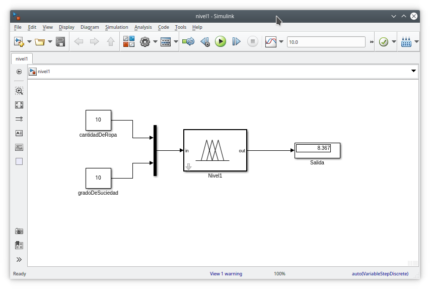
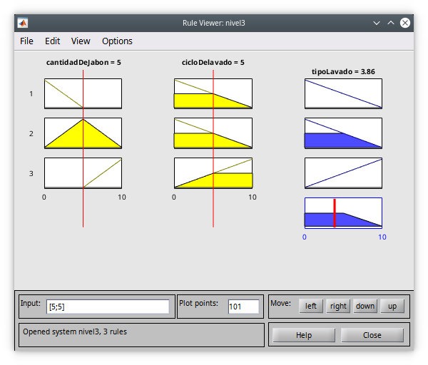

## Modelo fuzzy de lavadora industrial
### a1) Si un sistema FIS dispone de n variables de entrada con m particiones cada una, ¿cuántas reglas de inferencia deberían implementarse para que todas las condiciones del sistema estén consideradas?

~~~
El numero de reglas de inferencia es igual a n x m
~~~

### a2) ¿Qué puede ocurrir si no se implementan todas las reglas? Explicar

~~~
Si no se implementan todas las reglas lo que puede ocurrir es que la salida (Defusificación) tenga un amplio margen de error. 
~~~

### b Un sistema para la regulación automática fuzzy, de las cantidades de jabón y tiempo de lavado que debe utilizar una lavadora industrial dispone de las siguientes reglas:

- R1 Si hay poca cantidad de ropa y el grado de suciedad es bajo, entonces la cantidad de jabón debe ser escasa.
- R2 Si hay poca cantidad de ropa y el grado de suciedad es alto, entonces la cantidad de jabón debe ser normal
- R3 Si la cantidad de ropa es normal y el grado de suciedad es bajo, entonces la cantidad de jabón debe ser escasa.
- R4 Si la cantidad de ropa es normal y el grado de suciedad es alto, entonces la cantidad de jabón debe ser mucha.
- R5 Si la cantidad de jabón es normal o escasa, el ciclo de lavado debe ser corto.
- R6 Si la cantidad de jabón es mucha, el ciclo de lavado debe ser largo.

### c  Identificar las variables lingüísticas, alcances, particiones y proponer y graficar funciones de pertenencia coherentes, asociadas a las reglas fuzzy empleadas por el sistema.
#### Variables linguisticas
---
- Nivel 1
- Variables de entrada
    - Cantidad de ropa (Poca, Normal)
    - Grado de suciedad (bajo, alto)
- Variables de salida
    - Cantidad de jabón (Escasa, Normal, Mucha)\

---
- Nivel 2
- Variables de entrada
    - Cantidad de jabón (Escasa, Normal, Mucha)
- Variables de salida
    - Ciclo de lavado(Corto, Largo)\

---
- Nivel 3
- Variables de entrada
    - Cantidad de jabón(Escasa, Normal, Mucha)
    - Ciclo de lavado(Corto, Largo)
- Variables de salida
    - TipoLavado (Rapido, Profundo)\

---
#### d Establecer el método de implicación y defuzzyficación para que el sistema opere adecuadamente.
Metodo de implicacion
~~~
Aqui sugerimos usar el metodo de mamdani
~~~
Defuzzyficación
~~~
Centroide
~~~
#### e Implementar los sistemas FIS correspondientes (puede usar la GUI fuzzy) para que el sistema funcione y produzca resultados.

#### f Considerando que el sistema antes descripto funciona en dos niveles, investigar una situación adicional para implementar un tercer nivel en el sistema, que utilice como variables de entrada la variable de salida del nivel 1 y la variable de salida del nivel 2. (Orientación: puede ser por ejemplo un ciclo de secado, un periodo de extensión del lavado, un modo de lavado completo, u otro que se considere apropiado).

#### g Enunciar y resolver (y documentar) por lo menos cuatro casos de prueba del sistema, dos operando con los dos niveles iniciales y dos donde se incluyan los tres niveles.

